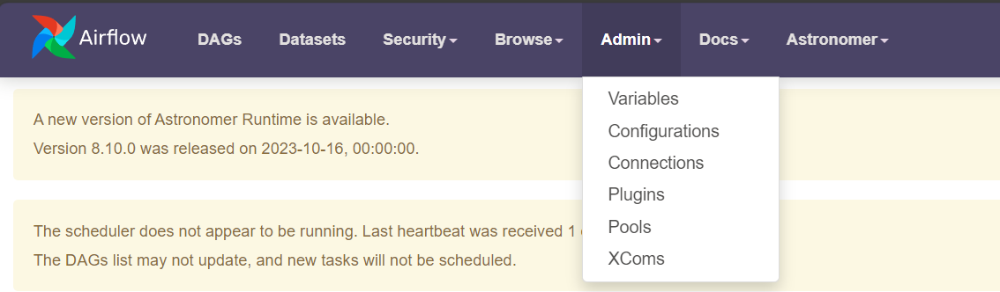
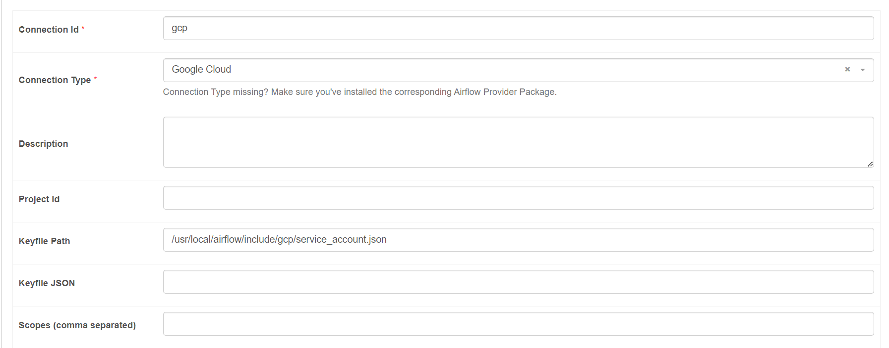

# Online Retail Sales Analysis
## Introduction
This personal project is a replication of work from this [Data Engineer Project](https://www.youtube.com/watch?v=DzxtCxi4YaA) with some minor tweaks. It provides good hands-on experiences for the following parts:
- To create a complete ELT data pipeline using Airflow to perform data analysis work.
- To utilise Astro CLI in setting up the Airflow local environment.
- To perform data quality check on data extraction and transformation parts via SODA.
- To integrate dbt into the data pipeline as to automate the data transformation and loading it into data warehouse.
- To upload data to GCS and ingesting the data into BigQuery table using the Astro SDK.

## ELT Pipeline
The ELT pipeline is illustrated below:


## Steps for Replicating Project Work
### Prerequisites
The followings tools are required for this project:
- Docker (Follow the instructions [here](https://docs.docker.com/desktop/install/windows-install/))
- Astro CLI (Follow the instructions [here](https://docs.astronomer.io/astro/cli/install-cli))
- SODA (Sign Up the 45-days free trial [here](https://www.soda.io/))
- A Google Cloud account

### Obtaining the Datasets
The dataset used for this project is obtained from [Kaggle-Online Retail](https://www.kaggle.com/datasets/tunguz/online-retail). The metadata of the dataset is as below:

| Column | Description |
|---|---|
|InvoiceNo | Invoice number. Nominal, a 6-digit integral number uniquely assigned to each transaction. If this code starts with letter 'c', it indicates a cancellation.|
|StockCode| Product (item) code. Nominal, a 5-digit integral number uniquely assigned to each distinct product.|
|Description|Product (item) name. Nominal.|
|Quantity|The quantities of each product (item) per transaction. Numeric.|
|InvoiceDate|Invoice Date and time. Numeric, the day and time when each transaction was generated.|
|UnitPrice|Unit price. Numeric, Product price per unit in sterling.|
|CustomerID|Customer number. Nominal, a 5-digit integral number uniquely assigned to each customer.|
|Country|Country name. Nominal, the name of the country where each customer resides.|

Special notes:
- The .csv file from the stated link contains data that are not able to decoded with **UTF-8**. Therefore, it is advised to use pandas to replace the errors and re-save it.
```python
df.to_csv(filepath,encoding='UTF-8', encoding_errors='replace')
```
### Initiating the Basic Structure of Apache Airflow
With the installation of Astro CLI, run the below command to set up the basic structure of the project which included the essential files and directories needed to get started with **Airflow development**.
```bash
astro dev init
```

After initiating the files and directories, the directory structure will be as below:
```
.
├── Dockerfile
├── README.md
├── airflow_settings.yaml
├── dags
│   ├── example_dag_advanced.py
│   └── example_dag_basic.py
├── include
├── packages.txt
├── plugins
├── requirements.txt
└── tests
    └── dags
        └── test_dag_example.py
```
**Astro** helps in simplifying the data pipeline development, making it easier to work with **Airflow**.

### Configuring the Apache Airflow
The configurations for the Apache Airflow are as below:
- Configure the **Dockerfile** following [this](/Dockerfile).
- Configure the **requirements.txt** following [this](/requirements.txt).
- Configure the **.env** file by adding following lines:
```
AIRFLOW__CORE__TEST_CONNECTION=enabled
PROTOCOL_BUFFERS_PYTHON_IMPLEMENTATION=pytho
```
- Create a GCS bucket with a unique name `<bucket_name>` on GC.
- Create a service account with a unique name `<service_account_name>` with Storage Admin and BigQuery Admin permissions.
- Generate a new credential key of that service account and save the JSON content in `include/gcp/` directory.
- Run the following command to build your Astro project into a Docker image and spin up a local Docker container for each Airflow component.
```bash
astro dev start
```

### Setting Up Connections between Airflow and GCP
The steps to set up the connections between **Airflow** and **GCP** are:
- Connect to the `http://localhost:8080/` to access the Airflow Web UI.
- Create a new connection from the `Admin → Connections` tab as shown in the images below:

- Add the details of the new connection as shown below:

    where the `Keypath Path` should be replaced with your own path to your service account credential key.

### Creating an Airflow DAG
Create a python script - [retail.py](dags/retail.py) for the Airflow DAG which contain all the necessary tasks for **ingesting data**,**checking data quality**, and **transforming data**.

The following libraries and functions should be included in the created python script, ensuring the tasks can be executed without errors.
```python
from airflow.decorators import dag, task
from datetime import datetime

from airflow.operators.python_operator import PythonOperator
from airflow.providers.google.cloud.transfers.local_to_gcs import LocalFilesystemToGCSOperator
from airflow.providers.google.cloud.operators.bigquery import BigQueryCreateEmptyDatasetOperator
from include.dbt.cosmos_config import DBT_PROJECT_CONFIG, DBT_CONFIG
from cosmos.airflow.task_group import DbtTaskGroup
from cosmos.constants import LoadMode
from cosmos.config import ProjectConfig, RenderConfig
from astro import sql as aql
from astro.files import File
from astro.sql.table import Table, Metadata
from astro.constants import FileType
```
#### Task 1: Uploading Data to GCS
The following codes are used to upload the [online_retail_encoded.csv](include/dataset/online_retail_encoded.csv) to GCS.
```python
@dag(
    start_date=datetime(2023, 1, 1),
    schedule=None,
    catchup=False,
    tags=['retail'],
)
def retail():

    upload_csv_to_gcs = LocalFilesystemToGCSOperator(
        task_id='upload_csv_to_gcs',
        src='include/dataset/online_retail_encoded.csv',
        dst='raw/online_retail.csv',
        bucket='p001_retail',
        gcp_conn_id='gcp',
        mime_type='text/csv',
    )
```
make sure to replace `bucket` with your own bucket's name.

#### Task 2: Ingesting Data to BigQuery
Add the following codes to create a new dataset in BigQuery based on a given name and load the data from GCS to BigQuery.
```python
create_retail_dataset = BigQueryCreateEmptyDatasetOperator(
        task_id='create_retail_dataset',
        dataset_id='retail',
        gcp_conn_id='gcp',
    )
    
    gcs_to_raw = aql.load_file(
        task_id='gcs_to_raw',
        input_file=File(
            'gs://p001_retail/raw/online_retail.csv',
            conn_id='gcp',
            filetype=FileType.CSV
        ),
        output_table=Table(
            name='raw_invoices',
            conn_id='gcp',
            metadata=Metadata(schema='retail')
        ),
        use_native_support=False,
    )
```

#### Task 3: Perform data quality check
The following procedures are needed to perform the data quality check on the ingested data.
- Create following subfolders:
    - `include/soda`
    - `include/soda/checks/`
    - `include/soda/checks/sources/`
- Create a `configuration.yml` file with the following details:
```yml
data_source retail:
  type: bigquery
  connection:
    account_info_json_path: /usr/local/airflow/include/gcp/service_account.json
    auth_scopes:
    - https://www.googleapis.com/auth/bigquery
    - https://www.googleapis.com/auth/cloud-platform
    - https://www.googleapis.com/auth/drive
    project_id: 'airflow-project-414407'
    dataset: retail

# soda API key
soda_cloud:
  host: cloud.soda.io
  api_key_id: 1deba518-2efd-41cc-89da-f1aee935549c
  api_key_secret: dFFp9TAduRgr6On2YGH4iGPqMdCKmMc_YZeaTuo0baiySfIKPQRrSQ
```
Make sure to replace `account_info_json_path`, `project_id`, and `soda API key` with your own value. For the soda API key, you can generated through creating a Soda Cloud account → Create an API → Profile → API Keys → Create API → Copy API.
- Test the connection by running the following commands:
```bash
astro dev bash
soda test-connection -d retail -c include/soda/configuration.yml
```
- Create a [raw_invoices.yml](include/soda/checks/sources/raw_invoices.yml) in the `include/soda/checks/sources/` direcotry. 
- Create a [check_function.py](include/soda/check_function.py) in `include/soda`. The same function is reusable in later stage for checking data quality on transformed data.
```python
# include/soda/check_function.py
def check(scan_name, checks_subpath=None, data_source='retail', project_root='include'):
    from soda.scan import Scan

    print('Running Soda Scan ...')
    config_file = f'{project_root}/soda/configuration.yml'
    checks_path = f'{project_root}/soda/checks'

    if checks_subpath:
        checks_path += f'/{checks_subpath}'

    scan = Scan()
    scan.set_verbose()
    scan.add_configuration_yaml_file(config_file)
    scan.set_data_source_name(data_source)
    scan.add_sodacl_yaml_files(checks_path)
    scan.set_scan_definition_name(scan_name)

    result = scan.execute()
    print(scan.get_logs_text())

    if result != 0:
        raise ValueError('Soda Scan failed')

    return result
```
- Add the following codes to create a task to perform data quality checking.
```python
# Add this part before the dag block
def check_load(scan_name='check_load', checks_subpath='sources'):
    from include.soda.check_function import check
    return check(scan_name, checks_subpath)
```
```python
# Add this part within the dag block
check_load_task = PythonOperator(
        task_id='check_load',
        python_callable = check_load,
    )
```